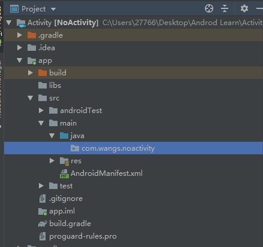
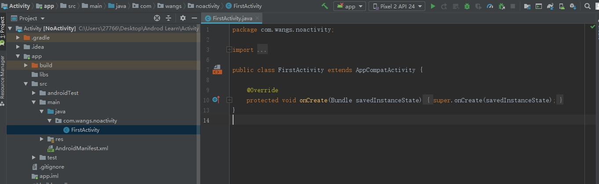
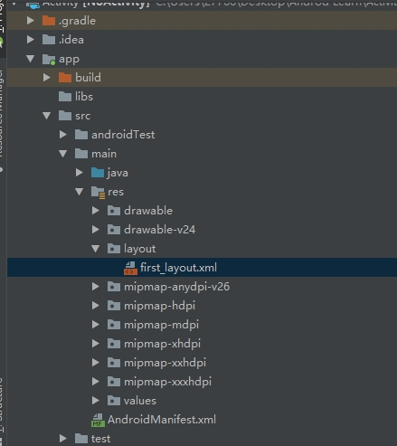
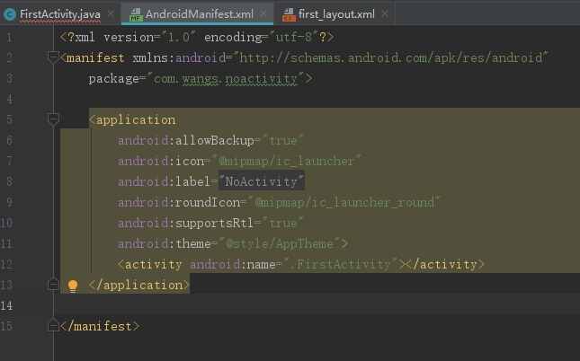
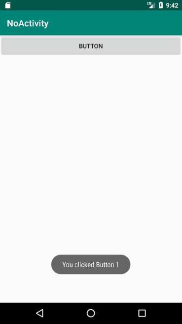
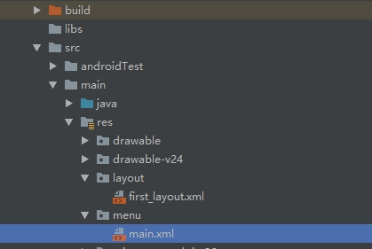
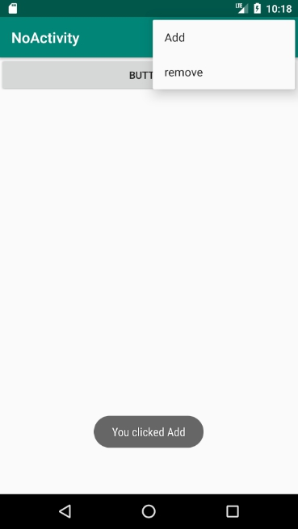

## Contents

[TOC]


## Activity

### Create a new project with Empty Activity



create a new empty activity in .noactivity, without Generate Layout file



create a new folder named layout in app/scr/main/res

create a layout resource file in it



### Add a Button

Then check the Text bar

``` xml
<?xml version="1.0" encoding="utf-8"?>
<LinearLayout xmlns:android="http://schemas.android.com/apk/res/android"
    android:orientation="vertical" android:layout_width="match_parent"
    android:layout_height="match_parent">

    <Button
        android:id="@+id/button1"
        android:layout_width="match_parent"
        android:layout_height="wrap_content"
        android:text="Button" />
</LinearLayout>
```

* review

  ``` xml
  @id/idname // 引用id
  ```

Here use 

``` xml
@+id/button1	//定义id
```

### Add this activity in FirstActivity.java

add this line in FirstActivity.onCreate method

``` java
setContentView(R.layout.first_layout);
```

### Register in AndroidMainfest

Android Studio Automatically Register it for us


​	 

### Config Main Activity

add 

``` xml
<activity android:name=".FirstActivity">
    <intent-filter>
        <action android:name="android.intent.action.MAIN"/>
        <category android:name="android.intent.category.LAUNCHER"/>
    </intent-filter>
</activity>
```

### Error: Default Activity not found

Because I type a wrong word in <inter-filter>

### Run the app

## Use Toast in Activity

### Intruduction

Notify brief message to user in App, which will disappear automatically in a while, besides it doesn't occupy any screen space

### Code

``` java
    protected void onCreate(Bundle savedInstanceState) {

        super.onCreate(savedInstanceState);
        setContentView(R.layout.first_layout);
        Button button1 = (Button) findViewById(R.id.button1);
        button1.setOnClickListener(new View.OnClickListener() {
            @Override
            public void onClick(View v) {
                Toast.makeText(FirstActivity.this, "You clicked Button 1",
                        Toast.LENGTH_SHORT).show();
            }
        });
    }
```

* In an activity, use findViewById() method to get elements in layout file, here we pass R.id.button1 to get Button instance.
* After get instance of Button1, run setOnClickListener() method to assign a listener, whenever click the button, method in the litener(onClick()) will execute
* Toast is easy to use. Use Static method makeText() to create a toast object, then run show() to show it.

* makeText(Context, text, time)

### resualt



## Menu

### Add file

Add a Dictionary sub scr/mian/res

Add a new menu Resource file



### opreate

#### menu file

Add code in Text Bar:

``` xml
<?xml version="1.0" encoding="utf-8"?>
<menu xmlns:app="http://schemas.android.com/apk/res-auto"
    xmlns:android="http://schemas.android.com/apk/res/android">
    <item
        android:id="@+id/add_item"
        android:title="@string/add" />
    <item
        android:id="@+id/remove_item"
        android:title="@string/remove" />
</menu>
```

or add menu item in Design Bar, add corresponding id

#### FirstActivity.java

shortcut : Ctrl+O to overwrite onCreateOptionMenu() method.

add 

``` java
    @Override
    public boolean onCreateOptionsMenu(Menu menu) {
        getMenuInflater().inflate(R.menu.main,menu);
        return true;
    }
    @Override
    public boolean onOptionsItemSelected(@NonNull MenuItem item) {
        switch (item.getItemId()) {
            case R.id.add_item:
                Toast.makeText(this, "You clicked Add", Toast.LENGTH_SHORT).show();
                break;
            case R.id.remove_item:
                Toast.makeText(this, "You clicked Remove", Toast.LENGTH_SHORT).show();
                break;
            default:
                break;
        }
        return true;
    }

```

over onCreate() method

### resualt



## Kill an activity

### finish()

finish() method is for kill an activity, like click back button

### code

```java
    protected void onCreate(Bundle savedInstanceState) {

        super.onCreate(savedInstanceState);
        setContentView(R.layout.first_layout);
        Button button1 = (Button) findViewById(R.id.button1);
        button1.setOnClickListener(new View.OnClickListener() {
            @Override
            public void onClick(View v) {
                finish();
                //Toast.makeText(FirstActivity.this, "You clicked Button 1",
                //        Toast.LENGTH_SHORT).show();
            }

        });


    }
```

### resualt

click button, then mobile return back to app menu.