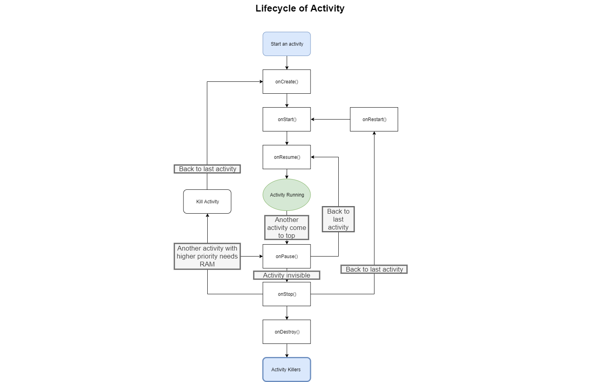

Be lazy for weekends, LOVE Monday :-)

share a song : [I Love Mondays](http://music.163.com/song?id=1331819055&userid=81821451) by Vexento


## content

[TOC]

## Send data by Intent

### Usage

Intent provide a serious of method 

```java 
putExtra(name,data)
```

,which store our data in Intent for temporary.

After Lunch the other activity, get these data form Intent by

```java
Intent intent = getIntent();
String data = intent.getStringExtra(name);
```

Attention that name of data in Intent should be the same.

### Code

In FirstActvity.java, add:

```java
        button1.setOnClickListener(new View.OnClickListener() {
            @Override
            public void onClick(View v) {
                String data = "Hello SecondAActivity";
                Intent intent = new Intent(FirstActivity.this, Second_activity.class);
                intent.putExtra("extra data",data);
                startActivity(intent);
            }

        });
```

in Second_activity.java, add:

```java
    protected void onCreate(Bundle savedInstanceState) {
        super.onCreate(savedInstanceState);
        setContentView(R.layout.activity_second_activity);
        Intent intent = getIntent();
        String data = intent.getStringExtra("extra data");
        log.d("Second Activity",data);
    }
```

> tips: Alt+Enter to automatically import dependent  package

### Result

After click BUTTON, we can find log message in logcat bar:

```bat
2019-09-23 10:47:08.115 11591-11591/com.wangs.noactivity D/Second Activity: Hello SecondAActivity
```

## Return data back by Intent

There is a method called

```java
startActivityForResualt(intent,request_code)
```

which will return a result to last activity before it's killed.

### Usage
#### FirstActivity.java
In FirstActivity.java, we start the Second Activity by 

```java
sartActivityForResualt(intent,requestCode)
```

rather than

```java
startActivity(intent)
```


#### Second_activity.java
In the Second_activity.java, we set button as "finish" button, whenever click it will return back to last activity. Besides, it will send data back to last activity:

##### Button

```java
        Button Button2 = (Button) findViewById(R.id.button_2);
        Button2.setOnClickListener(new View.OnClickListener(){
            @Override
                    public void onClick(View v){
                    //Your code
            }
        });
```


##### Intent

```java
                Intent intent = new Intent();
                intent.putExtra("data return","Hello First Activity");
                setResult(RESULT_OK,intent);
```

As u can see, we create an Intent object only for store data and return data, and the latter one by:

```java
setResualt(int Resualt_code, intent_data) ;
/*Commonly, Resualt code use:
RESUALT_OK
RESUALT_CANCELLED
```

##### Code

A combination of above two

```java
        Button Button2 = (Button) findViewById(R.id.button_2);
        Button2.setOnClickListener(new View.OnClickListener(){
            @Override
                    public void onClick(View v){
                Intent intent = new Intent();
                intent.putExtra("data return","Hello First Activity");
                setResult(RESULT_OK,intent);
                finish();
            }
        });
```


#### FirstActivity.java

Back to First Activity.java, Add 'onActivityResult' method to get result.

> Ctrl + O to add method

#### Code

```java
    @Override
    protected void onActivityResult(int requestCode, int resultCode, @Nullable Intent data) {
        switch (requestCode){
            case 1:
                if(resultCode == RESULT_OK){
                    String return_Data = data.getStringExtra("data return");
                    Log.d("First Activity", return_Data);
                }
                break;
            default:
        }
    }
```

```java
        button1.setOnClickListener(new View.OnClickListener() {
            @Override
            public void onClick(View v) {
                String data = "Hello SecondAActivity";
                Intent intent = new Intent(FirstActivity.this, Second_activity.class);
                intent.putExtra("extra data",data);
                startActivityForResult(intent,1);
            }

        });
```

### Result

```bat
2019-09-23 11:47:44.849 12488-12488/com.wangs.noactivity D/First Activity: Hello First Activity
```

After change keyword from "data_return" to "data return", successfully get what we expected.

### extend

what if we want to get return data by press 'back button' rather than "BUTTON2"?

override onBackPress() method to:

> shortcut: Ctrl + O

```java
    @Override
    public void onBackPressed() {
        Intent intent = new Intent();
        intent.putExtra("data return","Hello First Activity");
        setResult(RESULT_OK,intent);
        finish();
        super.onBackPressed();
    }
```

# lifecycle of a Activity

> Activity in Android use stack, called 'Back Stack'

## Activity state

### Run State

An activity at the top of 'Back Stack'.

### Pause State

An activity NOT at the top of 'Back Stack', but still visible in the screen.

### Stop State

Activity NOT at the top of  'Back Stack', and invisible.

### Destroy State

After an activity was removed from 'Back Stack'.

## Activity Lifecycle

### Method

Activity class defined 7 methods, which coved every part of Activity Lifecycle:

```java
onCreate();	//Will run while activiry is creating
onStart();	//Will run when activity turn to visible from invisible
onResume();	//Stays on top of 'Back Stack'
onPause();	//Will run when system changing to another activity
		    //Usually release resources in this method
			//Run if new activity is a chat-frame-like activy
onStop();	//Will run when activisity completely invisible
onDestory();//Run before activity is destroy
onRestart();//Run when activity turn to 'Run' from 'Stop'

```

### Complete Lifecycle(完整生存期)

from onCreate() to onDestroy()

onCreate()  -> onDestroy()

### Visible Lifecycle(可见生存期)

onStart() -> onStop()

Rotationally use resources through visible lifecycle.

Like load resources in onStart() method, Release resources in onStop().

### Top Lifecycle(前台生存期)

onResume() -> onPause()

in this cycle, activity is always on top, keeps running.



