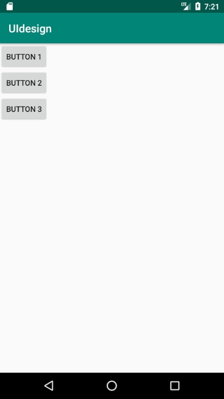
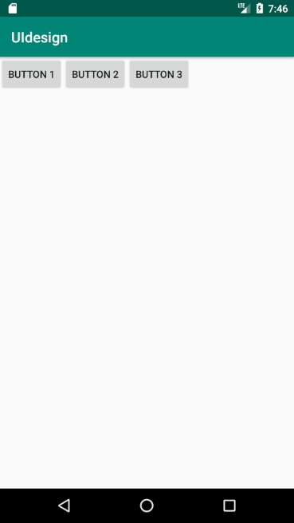
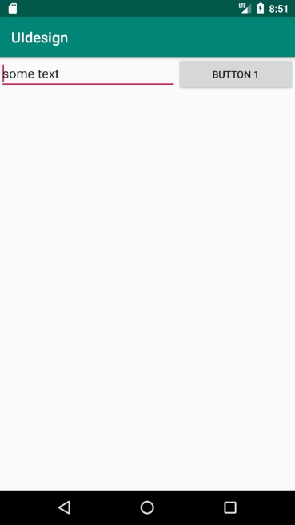
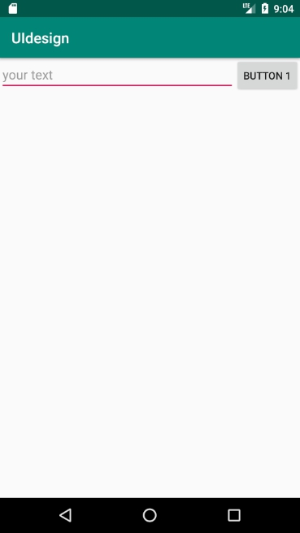
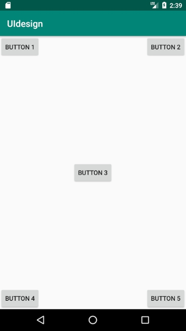
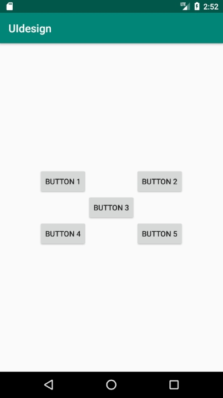
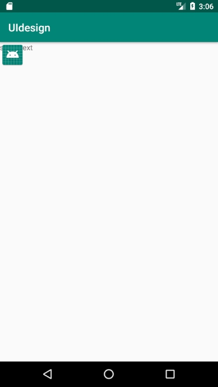
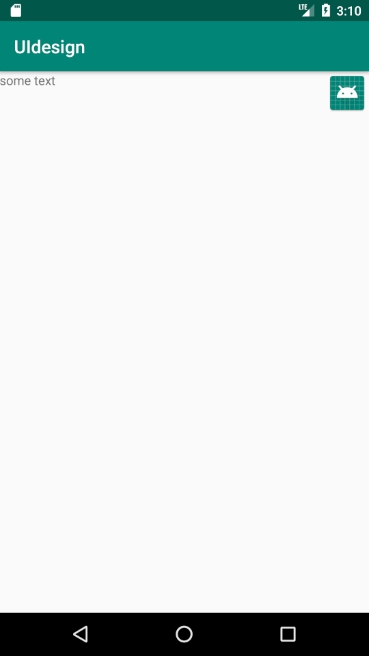
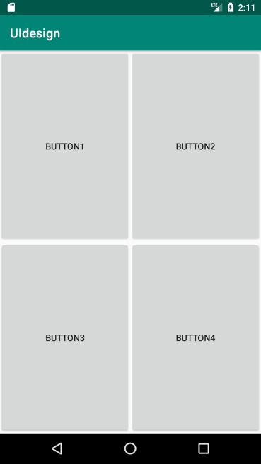

[TOC]

# UI design

## Widget

easy to use find.

Use auto-fill or `ctrl+shift+space`to get suggestion

## Layout

### `LinearLayout`

#### vertical

```xml
<?xml version="1.0" encoding="utf-8"?>
<LinearLayout xmlns:android="http://schemas.android.com/apk/res/android"
    xmlns:app="http://schemas.android.com/apk/res-auto"
    xmlns:tools="http://schemas.android.com/tools"
    android:orientation="vertical"
    android:layout_width="match_parent"
    android:layout_height="match_parent"
    tools:context=".MainActivity">
    <Button
        android:layout_width="wrap_content"
        android:layout_height="wrap_content"
        android:text="button 1"/>
    <Button
        android:layout_width="wrap_content"
        android:layout_height="wrap_content"
        android:text="button 2"/>
    <Button
        android:layout_width="wrap_content"
        android:layout_height="wrap_content"
        android:text="button 3"/>
</LinearLayout>
```




#### horizontal

`android:orientation="vertical"`



#### `android:layout_weight`

when use `android:layout_weight` `android:layout_width` will lose efficacy

```xml
<?xml version="1.0" encoding="utf-8"?>
<LinearLayout xmlns:android="http://schemas.android.com/apk/res/android"
    xmlns:app="http://schemas.android.com/apk/res-auto"
    xmlns:tools="http://schemas.android.com/tools"
    android:orientation="horizontal"
    android:layout_width="match_parent"
    android:layout_height="match_parent"
    tools:context=".MainActivity">
    <EditText
        android:layout_width="0dp"
        android:layout_height="wrap_content"
        android:text="some text"
        android:layout_weight="3"/>
    <Button
        android:layout_width="0dp"
        android:layout_height="wrap_content"
        android:layout_weight="2"
        android:text="button 1"/>
</LinearLayout>
```



or you can 

```xml
<?xml version="1.0" encoding="utf-8"?>
<LinearLayout xmlns:android="http://schemas.android.com/apk/res/android"
    xmlns:app="http://schemas.android.com/apk/res-auto"
    xmlns:tools="http://schemas.android.com/tools"
    android:orientation="horizontal"
    android:layout_width="match_parent"
    android:layout_height="match_parent"
    tools:context=".MainActivity">
    <EditText
        android:layout_width="0dp"
        android:layout_height="wrap_content"
        android:hint="your text"
        android:layout_weight="1"/>
    <Button
        android:layout_width="wrap_content"
        android:layout_height="wrap_content"
        android:text="button 1"/>
</LinearLayout>
```

to have a better display result.



### `RealativeLayout`

#### code

```xml
<?xml version="1.0" encoding="utf-8"?>
<RelativeLayout xmlns:android="http://schemas.android.com/apk/res/android"
    xmlns:app="http://schemas.android.com/apk/res-auto"
    xmlns:tools="http://schemas.android.com/tools"
    android:orientation="horizontal"
    android:layout_width="match_parent"
    android:layout_height="match_parent"
    tools:context=".MainActivity">

    <Button

        android:layout_width="wrap_content"
        android:layout_height="wrap_content"
        android:layout_alignParentTop="true"
        android:layout_alignParentLeft="true"
        android:text="button 1"
    />
    <Button

        android:layout_width="wrap_content"
        android:layout_height="wrap_content"
        android:layout_alignParentRight="true"
        android:layout_alignParentTop="true"
        android:text="button 2"
        />
    <Button

        android:layout_width="wrap_content"
        android:layout_height="wrap_content"
        android:layout_centerInParent="true"
        android:text="button 3"
        />
    <Button

        android:layout_width="wrap_content"
        android:layout_height="wrap_content"
        android:layout_alignParentBottom="true"
        android:layout_alignParentLeft="true"
        android:text="button 4"
        />
    <Button

        android:layout_width="wrap_content"
        android:layout_height="wrap_content"
        android:layout_alignParentRight="true"
        android:layout_alignParentBottom="true"
        android:text="button 5"
        />
</RelativeLayout>
```

All button's parent is the activity screen, so

#### result



#### set parent as button3

```xml
<?xml version="1.0" encoding="utf-8"?>
<RelativeLayout xmlns:android="http://schemas.android.com/apk/res/android"
    xmlns:app="http://schemas.android.com/apk/res-auto"
    xmlns:tools="http://schemas.android.com/tools"
    android:orientation="horizontal"
    android:layout_width="match_parent"
    android:layout_height="match_parent"
    tools:context=".MainActivity">


    <Button
        android:id="@+id/button3"
        android:layout_width="wrap_content"
        android:layout_height="wrap_content"
        android:layout_centerInParent="true"
        android:text="button 3"
        />
    <Button

        android:layout_width="wrap_content"
        android:layout_height="wrap_content"
        android:layout_above="@id/button3"
        android:layout_toLeftOf="@id/button3"
        android:text="button 1"
        />
    <Button

        android:layout_width="wrap_content"
        android:layout_height="wrap_content"
        android:layout_above="@id/button3"
        android:layout_toRightOf="@id/button3"
        android:text="button 2"
        />
    <Button

        android:layout_width="wrap_content"
        android:layout_height="wrap_content"
        android:layout_below="@id/button3"
        android:layout_toLeftOf="@id/button3"
        android:text="button 4"
        />
    <Button

        android:layout_width="wrap_content"
        android:layout_height="wrap_content"
        android:layout_below="@id/button3"
        android:layout_toRightOf="@id/button3"
        android:text="button 5"
        />
</RelativeLayout>
```

#### result



### `FrameLayout`

Use less than other layout.

Put on left-top by default.

#### code

```xml
<?xml version="1.0" encoding="utf-8"?>
<FrameLayout xmlns:android="http://schemas.android.com/apk/res/android"
    xmlns:app="http://schemas.android.com/apk/res-auto"
    xmlns:tools="http://schemas.android.com/tools"
    android:orientation="horizontal"
    android:layout_width="match_parent"
    android:layout_height="match_parent"
    tools:context=".MainActivity">


<TextView
    android:layout_width="wrap_content"
    android:layout_height="wrap_content"
    android:text="some text"
/>
    <ImageView
        android:layout_width="wrap_content"
        android:layout_height="wrap_content"
        android:src="@mipmap/ic_launcher"/>
</FrameLayout>
```

#### result



But we can still use **`layout_gravity`**   to set position.

 ```xml
<?xml version="1.0" encoding="utf-8"?>
<FrameLayout xmlns:android="http://schemas.android.com/apk/res/android"
    xmlns:app="http://schemas.android.com/apk/res-auto"
    xmlns:tools="http://schemas.android.com/tools"
    android:orientation="horizontal"
    android:layout_width="match_parent"
    android:layout_height="match_parent"
    tools:context=".MainActivity">


<TextView
    android:layout_width="wrap_content"
    android:layout_height="wrap_content"
    android:layout_gravity="left"
    android:text="some text"
/>
    <ImageView
        android:layout_width="wrap_content"
        android:layout_height="wrap_content"
        android:layout_gravity="right"
        android:src="@mipmap/ic_launcher"/>
</FrameLayout>
 ```

#### result



### 'Percentage layout'

Firstly, we need to add dependence, in  `app/build.gradle`

```gradle
dependencies {
    implementation fileTree(dir: 'libs', include: ['*.jar'])
    implementation 'androidx.appcompat:appcompat:1.0.2'
    implementation 'androidx.constraintlayout:constraintlayout:1.1.3'
    implementation 'com.android.support:percent:24.2.1'
    testImplementation 'junit:junit:4.12'
    androidTestImplementation 'androidx.test:runner:1.1.1'
    androidTestImplementation 'androidx.test.espresso:espresso-core:3.1.1'
}
```

add `implementation 'com.android.support:percent:24.2.1'`, and don't forget to use 'alt+Enter' to get hints and click 'sync'.

#### code

In `activity_main.xml`

```xml
<?xml version="1.0" encoding="utf-8"?>
<androidx.percentlayout.widget.PercentFrameLayout
    xmlns:android="http://schemas.android.com/apk/res/android"
    xmlns:app="http://schemas.android.com/apk/res-auto"
    xmlns:tools="http://schemas.android.com/tools"
    android:orientation="horizontal"
    android:layout_width="match_parent"
    android:layout_height="match_parent"
    tools:context=".MainActivity">

    <Button
        android:text="button1"
        android:layout_gravity="left|top"
        app:layout_widthPercent = "50%"
        app:layout_heightPercent = "50%"/>
    <Button
        android:text="button2"
        android:layout_gravity="right|top"
        app:layout_widthPercent = "50%"
        app:layout_heightPercent = "50%"/>
    <Button
        android:text="button3"
        android:layout_gravity="left|bottom"
        app:layout_widthPercent = "50%"
        app:layout_heightPercent = "50%"/>
    <Button
        android:text="button4"
        android:layout_gravity="right|bottom"
        app:layout_widthPercent = "50%"
        app:layout_heightPercent = "50%"/>
</androidx.percentlayout.widget.PercentFrameLayout>
```

#### result



