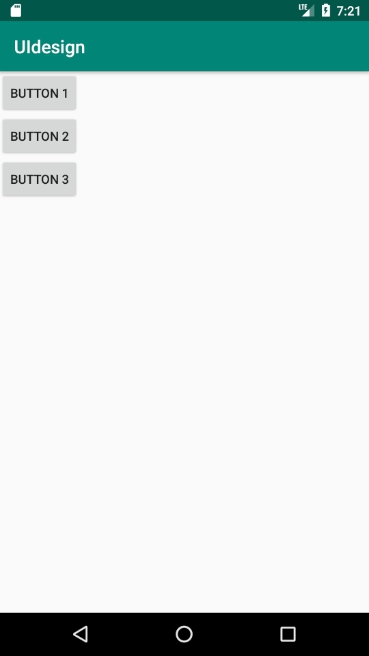
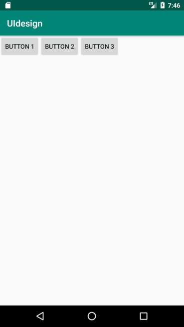
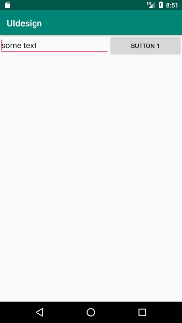
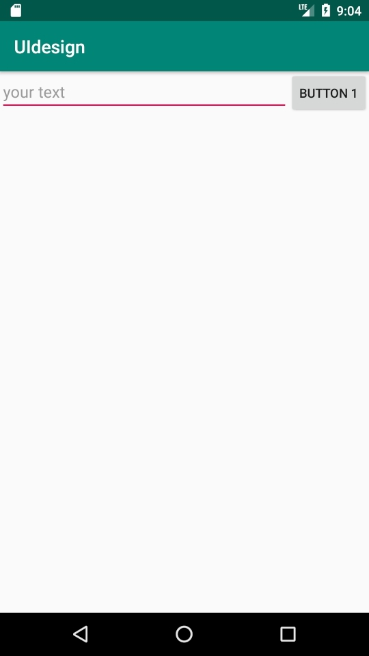

[TOC]

# UI design

## Widget

easy to use find.

Use auto-fill or `ctrl+shift+space`to get suggestion

## Layout

### `LinearLayout`

#### vertical

```xml
<?xml version="1.0" encoding="utf-8"?>
<LinearLayout xmlns:android="http://schemas.android.com/apk/res/android"
    xmlns:app="http://schemas.android.com/apk/res-auto"
    xmlns:tools="http://schemas.android.com/tools"
    android:orientation="vertical"
    android:layout_width="match_parent"
    android:layout_height="match_parent"
    tools:context=".MainActivity">
    <Button
        android:layout_width="wrap_content"
        android:layout_height="wrap_content"
        android:text="button 1"/>
    <Button
        android:layout_width="wrap_content"
        android:layout_height="wrap_content"
        android:text="button 2"/>
    <Button
        android:layout_width="wrap_content"
        android:layout_height="wrap_content"
        android:text="button 3"/>
</LinearLayout>
```




#### horizontal

`android:orientation="vertical"`



#### `android:layout_weight`

when use `android:layout_weight` `android:layout_width` will lose efficacy

```xml
<?xml version="1.0" encoding="utf-8"?>
<LinearLayout xmlns:android="http://schemas.android.com/apk/res/android"
    xmlns:app="http://schemas.android.com/apk/res-auto"
    xmlns:tools="http://schemas.android.com/tools"
    android:orientation="horizontal"
    android:layout_width="match_parent"
    android:layout_height="match_parent"
    tools:context=".MainActivity">
    <EditText
        android:layout_width="0dp"
        android:layout_height="wrap_content"
        android:text="some text"
        android:layout_weight="3"/>
    <Button
        android:layout_width="0dp"
        android:layout_height="wrap_content"
        android:layout_weight="2"
        android:text="button 1"/>
</LinearLayout>
```



or you can 

```xml
<?xml version="1.0" encoding="utf-8"?>
<LinearLayout xmlns:android="http://schemas.android.com/apk/res/android"
    xmlns:app="http://schemas.android.com/apk/res-auto"
    xmlns:tools="http://schemas.android.com/tools"
    android:orientation="horizontal"
    android:layout_width="match_parent"
    android:layout_height="match_parent"
    tools:context=".MainActivity">
    <EditText
        android:layout_width="0dp"
        android:layout_height="wrap_content"
        android:hint="your text"
        android:layout_weight="1"/>
    <Button
        android:layout_width="wrap_content"
        android:layout_height="wrap_content"
        android:text="button 1"/>
</LinearLayout>
```

to have a better display result.



### `RealativeLayout`


### `FrameLayout`


### 'Percent layout'

