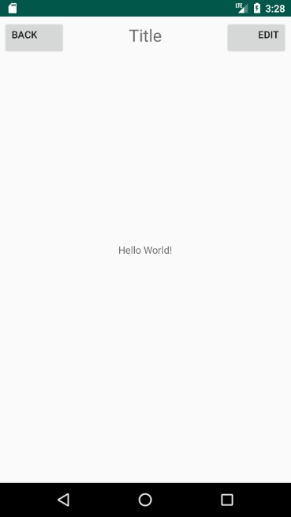

Sorry for my absent for full of 5 days. These days I was addicted to playing ' Skyrim Special Edition' and 'CSGO'. And this morning I feel guilty. 

"**The best time to plant a tree was 20 years ago. The second best time is now.**"

[TOC]

## Create your own default Layout

### `title.xml`

Create a new file as title.xml

set as `LineatLayout`, `horizonal` 

add two buttons, a text viewer.

```xml
<?xml version="1.0" encoding="utf-8"?>
<LinearLayout xmlns:android="http://schemas.android.com/apk/res/android"
    android:orientation="horizontal" android:layout_width="match_parent"
    android:layout_height="match_parent">
    <Button
        android:id="@+id/back"
        android:layout_width="wrap_content"
        android:layout_height="wrap_content"
        android:text="back"
        android:gravity="left"
        android:layout_margin="5dp"
        />
    <TextView
        android:id="@+id/title"
        android:layout_width="0dp"
        android:layout_height="wrap_content"
        android:gravity="center"
        android:layout_weight="1"
        android:text="Title"
        android:layout_margin="5dp"
        android:textSize="24dp"
        />
    <Button
        android:layout_width="wrap_content"
        android:layout_height="wrap_content"
        android:gravity="right"
        android:layout_margin="5dp"
        android:text="Edit" />
</LinearLayout>
```

### hide state bar

add to `MainActivity.java`

```java
        ActionBar actionbar = getSupportActionBar();
        if(actionbar != null){
            actionbar.hide();
        }
```

### change default page

add <include layout="@layout/title"/> to `activity_main.xml`

### result



Thought this way, no matter how many times `title.xml` layout needs to be used, only needs another line include code.

## Create custom widget

### Prepare

Add a java class as `TitleLayout.java`

``` java
public class TitleLayout extends LinearLayout {
    public TitleLayout(Context context, AttributeSet attrs){
        super(context, attrs);
        LayoutInflater.from(context).inflate(R.layout.title,this);
    }
}

```

change  `activity_main.xml`

```xml
<!--    <include layout="@layout/title"/>-->   
<com.wangs.uicustomviews.TitleLayout
        android:layout_width="match_parent"
        android:layout_height="wrap_content"
        />
```

### result

Same as use include method

### set Click Listener

change TitleLayout.java

```java
public class TitleLayout extends LinearLayout {
    public TitleLayout(Context context, AttributeSet attrs){
        super(context, attrs);
        LayoutInflater.from(context).inflate(R.layout.title,this);
        Button titleBack = (Button) findViewById(R.id.back);
        Button titleEdit = (Button) findViewById(R.id.edit);
        titleBack.setOnClickListener(new OnClickListener() {
            @Override
            public void onClick(View v) {
                ((Activity) getContext()).finish();
            }
        });
        titleEdit.setOnClickListener(new OnClickListener() {
            @Override
            public void onClick(View v) {
                Toast.makeText(getContext(),"You Clicked Edit button!",Toast.LENGTH_SHORT).show();
            }
        });
                
    }
}

```

### result

click BACK button, exit current app.

click Edit, a Toast shows 'You Clicked Edit button!'

