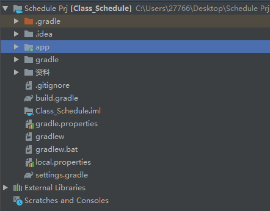
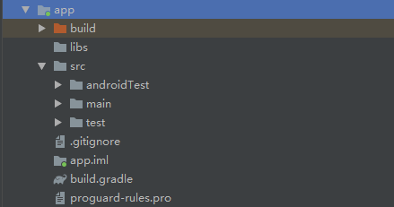

## 目录

[TOC]


## 了解目录



主要分析app目录，项目中的代码、资源等内容都位于此



* ### build

  包含编译时自动生成的文件

* ### libs

  项目若用到第三方jar包，则需要将这些包放在此文件下。位于此目录下的jar包都会杯自动添加到构建目录里

* ### scr/ androidTest

  用来编写Android Test测试用例的，可以对项目进行一些自动化测试

* ### scr/main/ java

  放置所有java代码的地方

* ### scr/main/res

  项目中使用到的所有图片、布局、字符串等资源都要存放在这个目录下

    * drawable 图片
    * layout 布局
    * minmap 应用图标
    * values 字符串、样式、颜色

* ### scr/main/AndroidMainfest.xml

  整个安卓项目中的配置文件，在程序中注册的所有四大组件都需要在这个文件里注册

* ### scr/test

  用来编写Unit Test测试用的，对项目进行自动化测试的另一种方式

* ### proguard-rules.pro

  用于指定项目代码的混淆规则

## AndroidMainfest.xml

```xml
<activity android:name=".MainActivity">
    <intent-filter>
        <action android:name="android.intent.action.MAIN" />

        <category android:name="android.intent.category.LAUNCHER" />
    </intent-filter>
</activity>
```

表示对MainActivity这个活动进行注册，没有在此文件里注册的活动是不能使用的

其中

``` xml
<inter-filter>
</inter-filter>
```

内的文件十分重要，上面两项是这个项目的主活动

ctrl+L click MainActivity，打开MainActivity.java

``` java
public class MainActivity extends AppCompatActivity {

    @Override
    protected void onCreate(Bundle savedInstanceState) {
        super.onCreate(savedInstanceState);
        setContentView(R.layout.activity_main);
    }
}
```

可看到MainActivity 是继承自AppCompatActivity，项目中的所有活动都必须继承它或者它的子类才能才能拥有活动的特性。

* ## string.xml

``` xml
<resources>
    <string name="app_name">Class_Schedule</string>
</resources>
```

在代码中获取app_name的引用

``` java
R.string.app_name
```

在XML中

``` xml
@string/app_name
```

这种格式是通用的，若引用图片资源，替换string为drawable即可，

如AndroidMainfest.xml中

```xml
<application
             android:allowBackup="true"
             android:icon="@mipmap/ic_launcher"
             android:label="@string/app_name"
             android:roundIcon="@mipmap/ic_launcher_round"
             android:supportsRtl="true"
             android:theme="@style/AppTheme">
</application>
```

## build.gradle

Android Studio使用Gradle来构建项目，其使用了一种基于Groovy的领域特定语言（DSL）来声明项目设置，摒弃了传统的基于XML的各种繁琐配置。

直接分析app内build.gradle

``` gradle
apply plugin: 'com.android.application'
```

应用了一个插件，一般有两个值可选

``` gradle
com.android.application //应用程序模块
com.android.library //库模块
```

接下来是一个android闭包

```  gradle
android {
    compileSdkVersion 29	//用于指配项目的编译版本
    buildToolsVersion "29.0.2"	//指定项目构建工具的版本
    defaultConfig {
        applicationId "com.Wangs.class_schedule"	//包名，若需修改则于此处修改
        minSdkVersion 24	//用于指定项目最低兼容的Android版本
        targetSdkVersion 29	
        versionCode 1	//指定项目的版本号
        versionName "1.0"	//指定项目的版本名
        testInstrumentationRunner "androidx.test.runner.AndroidJUnitRunner"
    }
    buildTypes {
        release {
            minifyEnabled false //是否对项目的代码进行混淆
            proguardFiles getDefaultProguardFile('proguard-android-optimize.txt'), 'proguard-rules.pro'	//指定混淆时使用的规则文件
        }
    }
}
```

然后时dependencies闭包,用来指定当前项目所有的依赖关系

通常有三种依赖方式

* 本地依赖：对本地的Jar包或目录添加依赖关系
* 库依赖：对项目中的库模块添加依赖关系
* 远程依赖：对jcenter库上的开源项目添加依赖关系

``` gradle
dependencies {
    implementation fileTree(dir: 'libs', include: ['*.jar'])	
    //本地依赖声明，将libs目录下所有.jar文件添加到项目的构建路径当中
    implementation 'androidx.appcompat:appcompat:1.0.2'
    //远程依赖声明，格式为{域名}:{组名}:{版本号}
    //加上此句后，Gradle在构建项目时会首先检查本地是否有此库的缓存
    implementation 'androidx.constraintlayout:constraintlayout:1.1.3'
    testImplementation 'junit:junit:4.12'
    androidTestImplementation 'androidx.test:runner:1.1.1'
    androidTestImplementation 'androidx.test.espresso:espresso-core:3.1.1'
}
```

## 使用Android的日志工具Log
    ```java
    Log.v(); 	//用于打印最繁琐的，意义最小的日志信息对应级别为verbose
    Log.d(); 	//调试信息，对应级别debug
    Log.i();	//打印重要的数据，对应级别info
    Log.w();	//打印警告信息，对应级别worn
    Log.e();	//打印错误信息，error
    ```

例子：

``` java
import android.util.Log;

public class MainActivity extends AppCompatActivity {
    private static final String my_app = "MainActivity";
    @Override
    protected void onCreate(Bundle savedInstanceState) {
        super.onCreate(savedInstanceState);

        setContentView(R.layout.activity_main);
        Log.d(my_app, "on Create execute");
    }
}
```

即可看到Logcat输出

``` bat
2019-09-18 18:09:25.258 3889-3889/com.Wangs.class_schedule D/MainActivity: on Create execute
```

## Logcat

  * 最右侧选择框Edit Filter Configuration可自行添加过滤器
  * 第三个选择框调整显示级别
  * 搜索框支持正则表达式